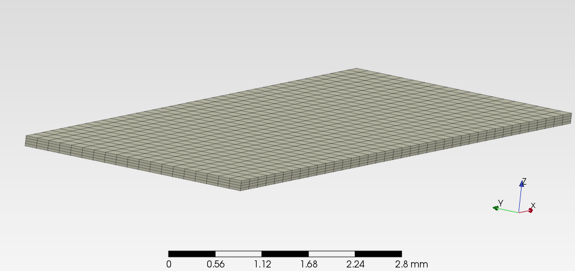

# Mesh Generator for CalculiX
## Motivation
Generating a 'nice' mesh is often a key part of any numerical modelling process. In some commercial software this can be handled with relative ease, with a degree of customisation, for example in abaqus you can use partitions to create a nice structured mesh. Structured meshes are often considered 'nice' mainly becuase they avoid locking which can occur in some meshes. However commercial licenses are expensive, and if parametric modelling is of interest, they are also cumbersome. If for example you want to generate training data for machine learning you will need to run hundreds of analyses. You then have two options, either run one after another usinng one license, or use many license tokens to run many analyses at once. This becomes very expensive very quickly. There are however many open source numerical modelling frameworks. Some are more user friendly than others, some assume you have a really strong understanding of how finite numerical modelling software is developed. Others are closer to what you might expect from a commerical software. 

After searching for some time I stumbled on a very effective combination of software. The foundation is CalculiX which is an open source finite element solver which is based on abaqus. It is built using fortran, and uses a similar input deck format to abaqus. In fact the format is so similar you can almost run an abaqus input deck directly in Calculix with a few sutble keyword modifications. However the solver does exact what you would expect, it will solve a problem that you define in an input file. It does not natively help you to make the input file. At this stage you have two options, either you type thousands of lines of code yourself and hope it is all correct. Alternatively, you use a preprocessor which typically is a GUI that will allow you to build a working input file that you can send to the solver. Some will also do that part for you, and let you see the results. My personal preference is software called [PrePoMax](https://prepomax.fs.um.si/). This is sort of similar to abaqus, but in my opinion it looks and works a bit better. The layout in particularly is nicer looking and very clean and simple to use. 

Now, with this setup you have the capability to run many models in parallel, and use a nice graphic user interface to build everything. The only last remaining problem is meshing. There is good support in PrePoMax for meshing geometry. You can make that geometry where ever you like, my preference is [FreeCAD](https://www.freecad.org/), but you could use commerical software if you prefer. Meshing algorithms are not particularly simple pieces of software, and PrePoMax does not use their own, they interface with existing project. The best of these is [gmsh](https://gmsh.info/) which has support for structured meshes. In recent releases of PrePoMax there is support for gmsh, and for structured meshes. But the key limitation of many of the open source meshers is they are not user friendly, and currently PrePoMax is working on implementing the functionality in gmsh in a more userfriendly way. So, while PrePoMax is developing, I found that for many simple meshes, it is much easier to just write your own mesher.

Therefore I started this project which provides a tool for generating 3D mesh files suitable for use in CalculiX simulations. It allows for detailed customisation of mesh dimensions and properties through a configuration file, making it flexible for various engineering and simulation tasks.

The code currently goes as far as writing the nodes, elements, node sets, element sets (using bounding box). There is some support for surface definitions, but I have found this is much easier to add in a preprocessor such as PrePoMax. 

## Features

- Generate structured 3D mesh data.
- Configurable mesh dimensions and resolution.
- Output mesh data directly in formats compatible with CalculiX.
- Visual representation of generated mesh (`mesh.png` in the project folder).

## Getting Started

These instructions will get you a copy of the project up and running on your local machine for development and testing purposes.

### Prerequisites
The code only uses built in python packages, there should not be any requirement to install any extra packages. 

### Installing 
Clone this repo using git, or just download it for github if you prefer. 
```bash
git clone https://geirolafsson88/Python/mesh-generator.git
```
Then open anaconda prompt or your choice of python prompt and navigate to the repo on your local machine
```bash
cd mesh-generator
```

### Usage 
Modify the config.ini file to set up your mesh parameters, such as dimensions and node distribution. Here's a quick guide:

    Open config.ini in a text editor.
    Set the mesh dimensions and number of nodes per direction under the [mesh_parameters] section.
    Save your changes and close the file.

Once the model parameters are set how you like, run main.py and you should see information about what is being generated followed by a notification that the mesh has been writen to the file location you set in config.ini
```bash
python main.py
```

### Example Output
Here is an example of what is generated if you use the config file as supplied. 
